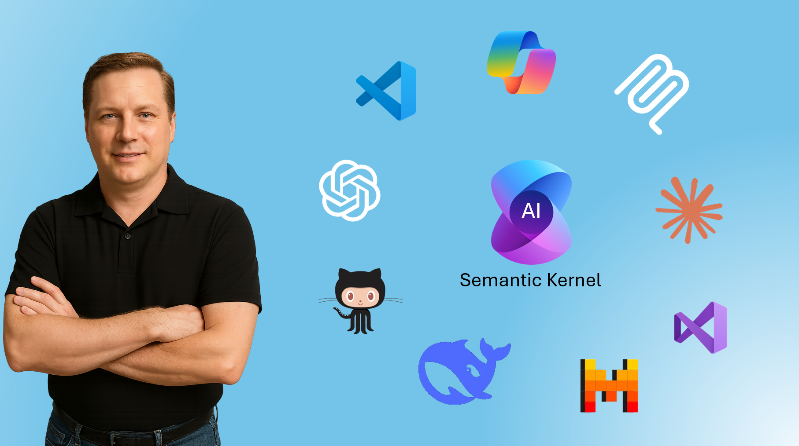

Source code for my [Udemy Course](https://www.udemy.com/course/building-smarter-ai-apps-with-semantic-kernel)

# Develop Agentic .NET Applications Using Semantic Kernel
## Master AI-Powered Application Development with Custom Tool Calls, RAG Implementation, MCP Integration and Orchestration

### **What you’ll learn**
* Learn the basics of AI and Large Language Models (LLMs)
* Gain Proficiency with Azure AI Foundry and deploying OpenAI Models
* Understand the core concepts of the Semantic Kernel Framework
* Learn how to use Semantic Kernel to connect to many different models and model providers including Azure OpenAI, OpenAI, Inferencing API
* Learn how to use Semantic Kernel to connect to local models using ONNX, Ollama and Hugging Face
* Gain proficiency by learning how to use Semantic Kernel with ASP.NET
* Attain expert proficiency in creating Semantic Kernel plugins and function calling, adhering to industry best practices
* Learn to quickly create Plugins using existing API Endpoints
* Understand the power of integrating Model Context Protocol (MCP) servers into Semantic Kernel
* Learn how RAG works, ingest documents to create context-aware, AI-powered apps using Retrieval-Augmented Generation

### **Are there any course requirements or prerequisites?**
* Basic .NET, C# and ASP.NET experience helpful by not necessary
* Visual Studio, VS Code or other .NET IDE
* Azure Subscription helpful but not required

### **Who this course is for:**
* Developers and Software Engineers looking to improve their AI skills by leveraging Semantic Kernel to create AI Infused Applications
* Business Analysts and Project Managers interested in leveraging AI for  Converting Data into Actionable Insights and Optimizing Business Processes

## Course Content

### Azure AI Foundry
- Introduction
- Deploy a Model
- User Prompts
- Chat History Overview
- System Prompt

### Semantic Kernel Foundation
- Introduction
- First Semantic Kernel Application
- Prompt Execution Settings
- Chat History
- Managing Chat History
- Response Streaming

### Model Providers
- Introduction
- OpenAI
- AI Inference
- Free GitHub Models
- Hugging Face
- ONNX Models
- Standalone Instances
- Ollama
- LM Studio

### Multimodal Models
- Introduction
- Overview
- System Prompt
- Upload Images
- Structured Output Class Definition
- Structured Output Response Format
- Structured Output JSON

### Native Plugins
- Introduction
- Review Aspire Dashboard
- Integrating Semantic Kernel with ASP.NET
- Your First Native Plugin
- Weather Plugin
- Geocode Plugin
- Personal Plugin

### OpenAPI Plugins
- Getting Started with OpenAPI Plugins
- Importing OpenAPI Spec and Understanding Best Practices
- Parallel Function Calling
- Conclusion

### MCP Plugins
- Understanding Model Context Protocol (MCP)
- Local & Remote MCP Servers
- MCP Clients
- Integrating with Semantic Kernel

### RAG - Retrieval-Augmented Generation
- Deep Dive: How Retrieval-Augmented Generation (RAG) Works
- Document Ingestion & Embedding with Azure AI Foundry and AI Search
- Building a RAG Plugin with Semantic Kernel and Azure AI Search
